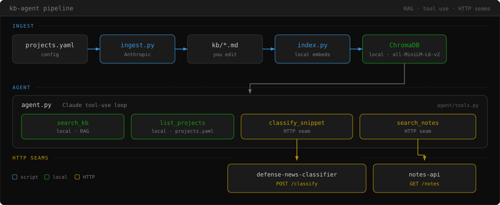

# kb-agent


A local knowledge base over the projects in `projects.yaml` and the libraries
they use. An agent answers questions from that knowledge base with retrieval
and tool use.

## How it works

<p align="center">
  <picture>
    <source media="(prefers-color-scheme: dark)" srcset="images/kb-agent-pipeline-dark.svg">
    <source media="(prefers-color-scheme: light)" srcset="images/kb-agent-pipeline-light.svg">
    
  </picture>
</p>

```
projects.yaml ──▶ ingest.py ──▶ kb/*.md ──▶ index.py ──▶ ChromaDB (local)
                  (Anthropic)   (you edit)   (local embeds)        │
                                                                   ▼
                          agent.py ──▶ search_kb · list_projects · classify_snippet · search_notes
                          (Claude tool-use loop)                          │ HTTP
                                                          ┌───────────────┴───────────────┐
                                                          ▼                               ▼
                                          defense-news-classifier /classify        notes-api /notes
```

- **`scripts/ingest.py`** reads each project's `pyproject.toml` or
  `requirements.txt` and README. The Anthropic API writes the KB stubs.
  Existing files stay unless you pass `--force`. `ingest.py --check` reports
  stubs that drifted from the source. `ingest.py --accept` records the current
  source as the baseline.
- **`scripts/index.py`** chunks `kb/*.md` and embeds them into a local
  ChromaDB collection with `all-MiniLM-L6-v2`. The embed step needs no API
  key. The default run re-embeds changed chunks only. `--rebuild` embeds
  from scratch.
- **`agent/tools.py`** exposes four tools. `search_kb` and `list_projects`
  run locally. `classify_snippet` POSTs to the defense-news-classifier
  `/classify` HTTP API. `search_notes` GETs the notes-api `/notes` HTTP API.
  Add an `endpoint:` field to a `projects.yaml` entry to make a service
  callable. If a service is down, the tool returns the start command.
- **`agent/agent.py`** is a manual Claude tool-use loop. The model searches
  the KB and answers from the tool results.
- **`mcp_server/server.py`** serves the same local tools over MCP. See
  [MCP server](#mcp-server).

## Setup

Python 3.11+ and [uv](https://docs.astral.sh/uv/) are required.

```bash
uv sync
```

Copy the example env file and set `ANTHROPIC_API_KEY`:

```bash
cp -n .env.example .env
```

## Usage

1. List the projects in `projects.yaml`. Then generate KB stubs:

   ```bash
   uv run python scripts/ingest.py
   ```

2. Build the local vector index. The first run downloads the embedding model:

   ```bash
   uv run python scripts/index.py
   ```

3. Ask questions in the browser. The UI opens at http://127.0.0.1:7860:

   ```bash
   uv run python app.py
   ```

   Or ask in the terminal:

   ```bash
   uv run python agent/agent.py
   ```

### Classifier service

`classify_snippet` calls the defense-news-classifier HTTP API. Start that
service from the classifier directory:

```bash
uv run --env-file .env uvicorn api:app --app-dir src --host 127.0.0.1 --port 8000
```

If the service is down, the tool returns this command. Then ask the agent to
classify a snippet.

## MCP server

Any MCP host can search the KB through this server. The server calls
`agent/tools.py` and returns the same SYS-003 observation JSON.

**Tools** (stdio):

| Tool | Arguments | What it does |
| --- | --- | --- |
| `search_kb` | `query`, `kind?` (`projects`\|`libraries`\|`notes`), `n_results?` (1–25, default 5) | Semantic search over the local ChromaDB index; returns matching chunks with their `source` files. |
| `list_projects` | — | Lists the projects tracked in `projects.yaml`. |

The server exposes only the two local tools. `classify_snippet` and
`search_notes` need another service, so they stay out of this install.

Start the server. It speaks JSON-RPC on stdin and stdout:

```bash
uv run python mcp_server/server.py
```

Register it with Claude Code. Run `scripts/index.py` first. If the KB is not
indexed, `search_kb` reports that.

```bash
claude mcp add kb-agent --scope user -- \
  uv run --directory /absolute/path/to/kb-agent python mcp_server/server.py
```

Confirm the server is connected, then use it:

```bash
claude mcp list        # -> kb-agent: ... - ✔ Connected
```

For Claude Desktop, add this block to `claude_desktop_config.json`:

```json
{
  "mcpServers": {
    "kb-agent": {
      "command": "uv",
      "args": ["run", "--directory", "/absolute/path/to/kb-agent",
               "python", "mcp_server/server.py"]
    }
  }
}
```

`--directory` tells `uv` which project environment to use. The server finds
the repo root from `__file__`.

## Retrieval eval

[`eval/gold_set.yaml`](eval/gold_set.yaml) is a hand-labeled set of 27 queries
and expected source files. The harness reports recall@1/@3/@5 and MRR. The run
is local and needs no API key. The KB must be indexed.

```bash
uv run python scripts/eval_retrieval.py
uv run python scripts/eval_retrieval.py --kind-filter
```

Save a run, then compare two runs:

```bash
uv run python scripts/eval_retrieval.py --json eval/baseline.json
uv run python scripts/eval_compare.py --baseline eval/baseline.json --candidate eval/candidate.json
```

These numbers are dated workstation measurements from 2026-07-17 on a
325-chunk index. They are not floors.

- Unfiltered: recall@5 **0.926**, MRR **0.781**
- Kind filter: recall@3 **1.000**, MRR **0.920**

CI reconstructs the notes corpus and runs both arms as a report. A merge does
not depend on the values.

The set at [`eval/compositional_set.yaml`](eval/compositional_set.yaml) exists
and has no harness yet.

## Observability

OpenTelemetry traces are off by default. Set `KB_AGENT_TRACING` to record
spans (`agent/telemetry.py`):

```bash
KB_AGENT_TRACING=1 uv run python agent/agent.py
KB_AGENT_TRACING=1 OTEL_EXPORTER_OTLP_ENDPOINT=http://localhost:4318 \
  uv run --extra otlp python agent/agent.py
```

The first command writes spans to stderr. The second also sends spans to an
OTLP collector.

Each turn emits `kb_agent.ask` → one `chat <model>` per model call → one
`execute_tool <name>` per tool call:

| Span | Key attributes |
| --- | --- |
| `kb_agent.ask` | `gen_ai.request.model`, `kb_agent.loop.iterations` (how many passes the turn took) |
| `chat <model>` | `gen_ai.usage.{input,output,cache_read,cache_creation}_tokens`, `gen_ai.response.finish_reasons` |
| `execute_tool <name>` | `gen_ai.tool.name`, `kb_agent.tool.status` (the SYS-003 status). Span duration is the tool latency. |

The console exporter needs no extra install. The OTLP exporter (`--extra otlp`)
sends the same spans to a collector.

## Status

The v1 release is a local KB with a Gradio UI and a CLI agent. An MCP server
exposes the same local tools. `classify_snippet` and `search_notes` call the
classifier and notes-api HTTP APIs. Tools follow `system/SYS-003`. OpenTelemetry
traces are opt-in through `KB_AGENT_TRACING`. Run the tests with `uv run pytest`.
